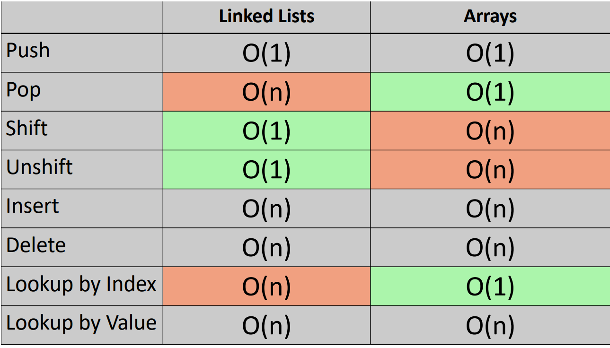

# LinkedList



- Since a LinkedList doesn't have an index, operations on the first element take constant time. However, for any other element, we need to traverse each node sequentially to reach the specific one, which takes linear time.
- Da eine LinkedList keinen Index hat, dauern Operationen am ersten Element konstant viel Zeit. Für alle anderen Elemente muss jedoch jeder nacheinander durchlaufen werden, um das spezifische Element zu erreichen , was lineare Zeit in Anspruch nimmt

```javascript
class LinkedList{
    constructor(value){
        create a new node
    }

    push(value){
        create a new node
        add Node to end
    }

    unshift(value){
        create a new node
        add Node to beginning
    }

    insert(value){
        create a new node
        insert Node
    }

}
```

- Since 'Creating a node' is dup, we create 'class Node', but targeting only 'value'

```javascript
class Node {
  constructor(value) {
    this.value = value;
    this.next = null;
  }
}
```
